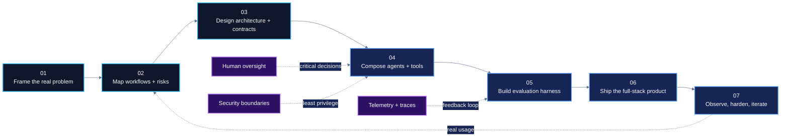

<!--
  ╭──────────────────────────────────────────────────────────────────────────────╮
  │  UMAIR KHAN — GITHUB PROFILE README                                         │
  │  Designed for GitHub's supported Markdown + sanitized HTML environment.      │
  │  Semantic focus: Agentic AI, AI Systems Architecture, Full-Stack AI, MCP,    │
  │  Cybersecurity AI, Healthcare AI, Technical Strategy, Fractional Leadership. │
  ╰──────────────────────────────────────────────────────────────────────────────╯
-->

 

  

 

 

<!-- ───────────────────────────── COMMAND DECK ───────────────────────────── -->

<table>
<tr>
<td width="58%" valign="top">

## I build AI systems that move beyond demos

I am a **Fullstack Agentic AI Engineer, AI systems architect, founder, and hands-on technical leader** working across the complete product lifecycle: **problem framing, technical strategy, architecture, implementation, evaluation, deployment, and operational hardening**.

My work lives at the intersection of:

<table>
<tr>
<td align="center"><b>Agentic AI</b> Stateful agents, tools, evaluation</td>
<td align="center"><b>Cybersecurity</b> Adversarial systems, threat intelligence</td>
</tr>
<tr>
<td align="center"><b>Public Infrastructure</b> Emergency response, healthcare</td>
<td align="center"><b>Enterprise Automation</b> Reliable workflows, measurable impact</td>
</tr>
</table>

I focus on environments where **reliability, traceability, latency, privacy, failure recovery, and real-world constraints** matter as much as model capability.

</td>
<td width="42%" valign="top">

### Engineering principles

<table>
<tr>
<td width="12%" align="center">◈</td>
<td><b>Architecture before abstraction</b> Solve the system before polishing the pattern.</td>
</tr>
<tr>
<td align="center">◉</td>
<td><b>Outcomes before theatre</b> Measure reliability, adoption, and operational value.</td>
</tr>
<tr>
<td align="center">⌁</td>
<td><b>Human control at critical edges</b> Autonomy where useful; oversight where consequential.</td>
</tr>
<tr>
<td align="center">⬡</td>
<td><b>Auditability by design</b> Traceable state, tool calls, decisions, and failure paths.</td>
</tr>
<tr>
<td align="center">↯</td>
<td><b>Pragmatic full-stack delivery</b> From data and agents to interfaces and infrastructure.</td>
</tr>
</table>

</td>
</tr>
</table>

> **A recurring theme in my work:** converting fragmented, high-friction workflows into dependable AI-assisted systems that people can actually use.

 

<!-- ───────────────────────────── IMPACT LEDGER ───────────────────────────── -->

  

<table>
<tr>
<td width="25%" align="center">

Deployed across seven university schools

</td>
<td width="25%" align="center">

Supported through the AI Tutor initiative

</td>
<td width="25%" align="center">

Delivered for US-based startup clients

</td>
<td width="25%" align="center">

Regional recognition for PUKAAR AI

</td>
</tr>
</table>

 

<!-- ───────────────────────── CAPABILITY CONSTELLATION ────────────────────── -->

 

<table>
<tr>
<td width="50%" valign="top">

### ◈ Agentic AI architecture

> **Designing autonomous systems with explicit state, controlled tools, and verifiable handoffs.**

`LangGraph` `OpenAI Agents SDK` `LangChain` `CrewAI` `MCP`

- Stateful graphs, DAGs, supervisors, routers, and specialist agents
- Planner–executor, evaluator–optimizer, and human-in-the-loop patterns
- Tool permissions, memory, context engineering, and retrieval pipelines
- Agent evaluation, failure recovery, and deterministic guardrails
- Local-model and air-gapped inference using vLLM

</td>
<td width="50%" valign="top">

### ⌘ Full-stack AI product engineering

> **Turning intelligent workflows into usable, observable, deployable products.**

`FastAPI` `Next.js` `TypeScript` `React` `WebSockets`

- Product scoping, system design, API boundaries, and data contracts
- Real-time dashboards, PWAs, voice interfaces, and operational tooling
- Streaming AI experiences and multi-channel integrations
- PostgreSQL, vector retrieval, event pipelines, and analytics
- CI/CD, deployment architecture, observability, and production hardening

</td>
</tr>
<tr>
<td width="50%" valign="top">

### ⛨ Cybersecurity and adversarial AI

> **Building systems that reason about threats, simulate pressure, and test model boundaries.**

`MITRE ATT&CK` `MITRE ATLAS` `gVisor` `Packer` `Threat Intel`

- CVE-to-lab automation and exploit-validation workflows
- Adversarial LLM testing with isolated execution
- Threat-intelligence ingestion, enrichment, and structured reporting
- Cyber-crisis simulations with AI-driven adversarial personas
- Security event pipelines, correlators, and predictive threat models

</td>
<td width="50%" valign="top">

### ◇ Technical strategy and leadership

> **Helping ambitious teams make the right technical decisions early—and execute them well.**

`Architecture` `Product Strategy` `Roadmaps` `Technical Due Diligence`

- Translating business goals into engineering systems and delivery plans
- Build-vs-buy analysis, stack selection, and risk-based architecture
- MVP design for constrained budgets, timelines, and environments
- Cross-functional delivery with founders, operators, and domain experts
- Engineering process, technical documentation, and team enablement

</td>
</tr>
</table>

 

<!-- ───────────────────────────── TECHNOLOGY MESH ─────────────────────────── -->

  

  

### Intelligence and orchestration

### Models and multimodal systems

### Data, security, and deployment

 

<!-- ───────────────────────────── FLAGSHIP SYSTEMS ────────────────────────── -->

 

<table>
<tr>
<td width="50%" valign="top">

### [A context layer for responsible enterprise AI](https://github.com/Umairkhan2324/trilith)

A **three-tier, language-agnostic context-management architecture** designed for private and responsible enterprise AI.

**System signal**
- Grounded in 20+ contemporary research papers
- Built around falsifiable hypotheses and experimental validation
- Designed for Python, TypeScript, Go, and Rust ecosystems
- Focused on context integrity, portability, and long-horizon reliability

`Context Engineering` `Enterprise AI` `Responsible AI` `Open Source`

</td>
<td width="50%" valign="top">

### A multilingual emergency-response operating layer

A platform designed to coordinate fragmented emergency services through **multilingual classification, agentic routing, incident tracking, escalation, and departmental intelligence**.

**System signal**
- Urdu, Roman Urdu, and English interaction
- Voice pipeline with Faster-Whisper, Qwen, vLLM, and LangGraph
- PWA optimized for 2G/3G environments
- WhatsApp fallback and on-premises deployment design
- Regional runner-up at the National Agentic AI Hackathon

`Emergency Response` `Voice AI` `Low Connectivity` `Public Infrastructure`

</td>
</tr>
<tr>
<td width="50%" valign="top">

### CVE identifiers → reproducible exploit-verified labs

A **seven-stage LangGraph multi-agent DAG** that transforms a CVE into a bootable virtual-machine lab across Linux and Windows targets.

**System signal**
- Variant-aware canonical research calls
- Six-category precondition routing
- Packer/HCL2 generation and provisioner libraries
- Automated environment construction and exploit validation
- Designed for repeatability, traceability, and security training

`Cybersecurity AI` `LangGraph DAG` `Packer` `HCL2` `Exploit Validation`

</td>
<td width="50%" valign="top">

### Multiplayer cyber-crisis simulation under pressure

A full-stack simulation environment with **LLM-driven adversarial personas, scenario generation, real-time injects, multi-channel theatre, and structured after-action review**.

**System signal**
- Simulated Gmail, social, market, Slack, and network channels
- Dynamic scenario and adversarial persona generation
- HSEEP-grounded after-action review workflows
- Real-time decision tracking and multiplayer interfaces
- Three.js-powered product presentation layer

`Crisis Simulation` `Adversarial Agents` `Next.js` `Real-Time Systems`

</td>
</tr>
<tr>
<td width="50%" valign="top">

### Surveillance, testing, reporting, and forecasting

A four-pillar system connecting **global threat surveillance, adversarial model testing, structured intelligence generation, and predictive forecasting**.

**System signal**
- Three-agent testing architecture with gVisor isolation
- Evaluator–optimizer intelligence reporting
- DeepSeek-R1 and Qwen-based analytical workflows
- Bayesian Belief Network forecasting using pgmpy
- Threat-intelligence ingestion from multiple security sources

`MITRE ATT&CK` `gVisor` `Threat Intelligence` `Bayesian Networks`

</td>
<td width="50%" valign="top">

### Multi-agent healthcare orchestration for public-service scale

A healthcare coordination platform with **controlled MCP tools, specialist agents, facility discovery, eligibility workflows, follow-up automation, and full audit trails**.

**System signal**
- Six autonomous domain agents
- Private MCP server with tool-level access controls
- NIH facility integration and geographic discovery
- Offline-first design for sub-1 Mbps rural environments
- Evidence-based workflow integration and outbreak-pattern detection

`Healthcare AI` `MCP` `Multi-Agent Systems` `Auditability` `Rural Systems`

</td>
</tr>
<tr>
<td width="50%" valign="top">

### [Embedding-based identity and attendance intelligence](https://github.com/Umairkhan2324/faceattend)

A computer-vision attendance system combining face detection, embedding generation, vector search, and administrative workflows.

**System signal**
- MTCNN detection and FaceNet embeddings
- Qdrant-powered similarity search
- Supabase-backed identity and attendance records
- Designed as a practical institutional workflow
- Presented as a deployable solution for education environments

`Computer Vision` `FaceNet` `MTCNN` `Qdrant` `Supabase`

</td>
<td width="50%" valign="top">

### [Structured research with evidence-aware agents](https://github.com/Umairkhan2324/Meta-Research-Agent)

An AI-assisted research system focused on information gathering, synthesis, tool use, and explainable output generation.

**System signal**
- Research decomposition and task orchestration
- Tool-assisted evidence gathering
- Structured synthesis and output pipelines
- Part of a broader exploration of reliable research agents

`Research Agents` `Tool Use` `Evidence Synthesis` `Automation`

</td>
</tr>
</table>

<b>✦ Open the wider project constellation</b>

 

| Project | Focus |
|---|---|
| [GenAI Agents](https://github.com/Umairkhan2324/GenAI_Agents) | Generative and agentic AI experiments, patterns, and implementations |
| [VaultSlip](https://github.com/Umairkhan2324/VaultSlip) | Receipt and document-oriented product engineering |
| [Research Assistant](https://github.com/Umairkhan2324/Research-Assistant) | AI-assisted research workflows |
| [Attendance System](https://github.com/Umairkhan2324/attendance-system) | Institutional attendance automation |
| [Ephemeral](https://github.com/Umairkhan2324/Ephemeral) | Applied product engineering experiment |
| [Alim](https://github.com/Umairkhan2324/Alim) | Substantial full-stack application architecture |

 

<!-- ───────────────────────────── BUILD PROTOCOL ──────────────────────────── -->

<table>
<tr>
<td width="33%" valign="top">

### Ⅰ — Deterministic boundaries

Probabilistic reasoning belongs inside clearly defined contracts, schemas, tool permissions, and state transitions.

</td>
<td width="33%" valign="top">

### Ⅱ — Evaluation before confidence

Agent quality must be tested through scenarios, traces, failure cases, and measurable acceptance criteria.

</td>
<td width="33%" valign="top">

### Ⅲ — Design for the environment

Connectivity, infrastructure, privacy, operator skill, cost, and deployment constraints shape the architecture.

</td>
</tr>
</table>

 

<!-- ───────────────────────────── EXPERIENCE MAP ──────────────────────────── -->

 

| Signal | Role and organization | What I own |
|:---:|---|---|
| `CYBER` | **Fullstack Agentic AI Engineer — Quantum Vanguard** | Multi-agent cybersecurity platforms, adversarial intelligence, simulation, AI SOC workflows |
| `PUBLIC SYSTEMS` | **Founder & CEO — PUKAAR AI** | Emergency-response architecture, multilingual AI, low-connectivity delivery |
| `HEALTH` | **Founder & CEO — AWAM SEHAT** | Healthcare orchestration, MCP architecture, evidence-based workflows |
| `PRODUCT` | **Co-Founder & CTO — ZAARIC** | AI product strategy and full-stack delivery for startup clients |
| `GOVERNANCE` | **AI Engineer — AI Governance Sandbox** | Regulatory analysis agents and compliance infrastructure |
| `EDUCATION` | **Project Lead — AI Tutor Initiative, UMT** | University-scale AI adoption and 235+ custom GPT deployments |
| `COMMUNITY` | **President — UMT Inter AI Club** | AI mentorship, technical education, events, and community leadership |

 

<!-- ───────────────────────────── CURRENT FRONTIER ────────────────────────── -->

<table>
<tr>
<td width="50%" valign="top">

- Reliable multi-agent systems with explicit state and verifiable handoffs
- Enterprise context architecture and long-horizon agent memory
- Secure MCP-based tool ecosystems
- Agent evaluation, runtime governance, and adversarial testing
- AI-assisted security operations and cyber-range automation
- Local, private, and air-gapped model deployment
- Voice-first and low-bandwidth intelligent interfaces
- Technical strategy for AI-native products and transformation programs

</td>
<td width="50%" valign="top">

I create the most value when a team has:

- a complex operational workflow that needs simplification;
- an AI prototype that must become a maintainable product;
- fragmented systems or tools that need orchestration;
- architecture decisions affecting cost, scale, security, or speed;
- a need for senior technical direction alongside hands-on execution;
- a product operating in a difficult or high-impact environment.

</td>
</tr>
</table>

 

<!-- ───────────────────────────── GITHUB SIGNAL ───────────────────────────── -->

  

<picture>
  <source
    media="(prefers-color-scheme: dark)"
    srcset="https://github-readme-stats.vercel.app/api?username=Umairkhan2324&show_icons=true&rank_icon=github&hide_border=true&bg_color=020617&title_color=38BDF8&icon_color=8B5CF6&text_color=CBD5E1"
  />
  <source
    media="(prefers-color-scheme: light)"
    srcset="https://github-readme-stats.vercel.app/api?username=Umairkhan2324&show_icons=true&rank_icon=github&hide_border=true&bg_color=FFFFFF&title_color=0369A1&icon_color=7C3AED&text_color=334155"
  />
  
</picture>

<picture>
  <source
    media="(prefers-color-scheme: dark)"
    srcset="https://github-readme-stats.vercel.app/api/top-langs/?username=Umairkhan2324&layout=compact&hide_border=true&langs_count=8&bg_color=020617&title_color=38BDF8&text_color=CBD5E1"
  />
  <source
    media="(prefers-color-scheme: light)"
    srcset="https://github-readme-stats.vercel.app/api/top-langs/?username=Umairkhan2324&layout=compact&hide_border=true&langs_count=8&bg_color=FFFFFF&title_color=0369A1&text_color=334155"
  />
  
</picture>

 

  

 

<!-- ───────────────────────────── FIELD NOTES ─────────────────────────────── -->

<b>✦ Field note: what production AI requires beyond the model</b>

 

A strong model is only one component of an operational AI system. Production delivery also requires:

- explicit state and ownership between agents;
- secure tools with least-privilege access;
- schemas, contracts, and validation at system boundaries;
- evaluation suites that reflect real user and failure scenarios;
- observability across model, agent, tool, and workflow behavior;
- intervention paths for high-impact decisions;
- infrastructure aligned with latency, privacy, cost, and connectivity constraints;
- documentation that allows another engineer to understand and operate the system.

<b>✦ Field note: topics I enjoy discussing</b>

 

Agent architecture, AI product strategy, context engineering, Model Context Protocol, retrieval systems, cybersecurity automation, evaluation harnesses, technical due diligence, startup architecture, voice AI, public-sector AI, local-model deployment, and responsible AI in emerging markets.

<b>✦ Field note: the kind of engineering culture I value</b>

 

Clear ownership. Strong technical writing. Honest trade-offs. Small feedback loops. Systems thinking. Measurable outcomes. Respect for operators and end users. The freedom to challenge assumptions—and the discipline to finish what matters.

 

<!-- ───────────────────────────── FOOTER SIGNAL ───────────────────────────── -->

  

Agentic AI · AI Systems Architecture · Full-Stack AI Engineering · Multi-Agent Systems · LangGraph · Model Context Protocol · Context Engineering · RAG · FastAPI · Next.js · Cybersecurity AI · Healthcare AI · AI Product Strategy · Technical Leadership

  

